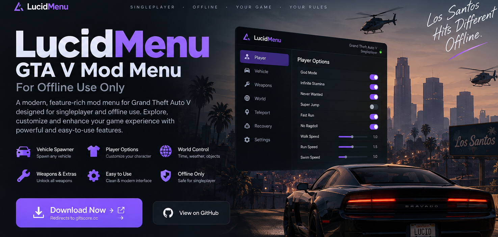
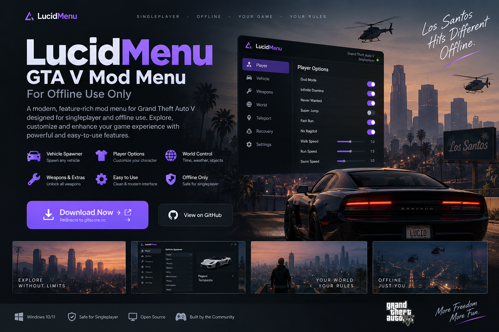

# LucidMenu

### GTA V SINGLEPLAYER MOD MENU

**A focused offline mod menu for experimenting, exploring and customizing Grand Theft Auto V singleplayer.**

 

 

---

## Overview

**LucidMenu** is a desktop mod menu concept built specifically for **Grand Theft Auto V singleplayer/offline play**.

The project is intended for players who want a cleaner way to experiment with the sandbox: spawn vehicles, adjust player attributes, change world conditions, teleport around the map, and access quality-of-life controls from one consistent interface.

It is **not designed for GTA Online**, competitive play, anti-cheat bypassing, account modification, or gaining an advantage over other players.

 

  
<b>YOUR GAME. YOUR RULES. OFFLINE.</b>

---

## Features

| Area | What it provides |
|---|---|
| **Player** | Singleplayer character and movement options |
| **Vehicles** | Vehicle spawning and local vehicle controls |
| **World** | Time, weather and sandbox world controls |
| **Teleport** | Quick movement between supported map locations |
| **Weapons** | Offline weapon and loadout utilities |
| **Interface** | Searchable, keyboard-friendly menu navigation |
| **Profiles** | Local preferences for supported menu settings |

> Exact functionality may vary by release and game version. Check the release notes before updating GTA V.

---

## Installation

### 1. Download

Use the official project download button:

### 2. Extract

Extract the downloaded archive into a separate folder.

### 3. Read the included release notes

Before installing or launching anything, check the included instructions for compatibility with your current GTA V version.

### 4. Start GTA V in Story Mode

LucidMenu is intended for **offline/singleplayer use only**.

### 5. Launch the supported build

Follow the instructions supplied with that release.

---

## Important: Offline Only

LucidMenu is intended exclusively for **Story Mode / singleplayer experimentation**.

Do not use it to interfere with multiplayer sessions, other players, online progression, anti-cheat systems, or Rockstar services. The project documentation does not provide instructions for bypassing anti-cheat or using the menu in GTA Online.

---

## Requirements

- Windows 10 or Windows 11
- A legitimate GTA V installation
- Supported GTA V game version
- Story Mode / offline play
- Sufficient permissions for the installation method documented by the release

---

## Compatibility

Game updates can change internal behavior and may temporarily break third-party mods. If an update has just been released, check the project's release notes before assuming the current build remains compatible.

Keeping backups of saves and modified files is recommended before installing third-party game modifications.

---

## Safety & Trust

Third-party game modifications should be treated like any other downloaded software:

- Download only from the project's documented distribution location.
- Review release notes and checksums when they are provided.
- Keep backups of important save files.
- Do not disable security software merely because an installer asks you to.
- Avoid builds redistributed by unknown third parties.

---

## FAQ

**Does LucidMenu work with GTA Online?**  
It is not intended or documented for GTA Online. Use it only in singleplayer/offline play.

**Will every GTA V update be supported immediately?**  
Not necessarily. Compatibility can change after game updates.

**Does it modify my online account or progression?**  
That is outside the project's intended scope.

**Should I back up my saves?**  
Yes. Backups are recommended before installing any third-party game modification.

---

## Disclaimer

LucidMenu is an independent community project and is not affiliated with or endorsed by Rockstar Games or Take-Two Interactive. Grand Theft Auto and related names and marks belong to their respective owners.

Use third-party modifications at your own risk and in accordance with the game's applicable terms and local law.

---

### LucidMenu

**MORE FREEDOM. MORE FUN. OFFLINE.**

Singleplayer • Windows • Community project

